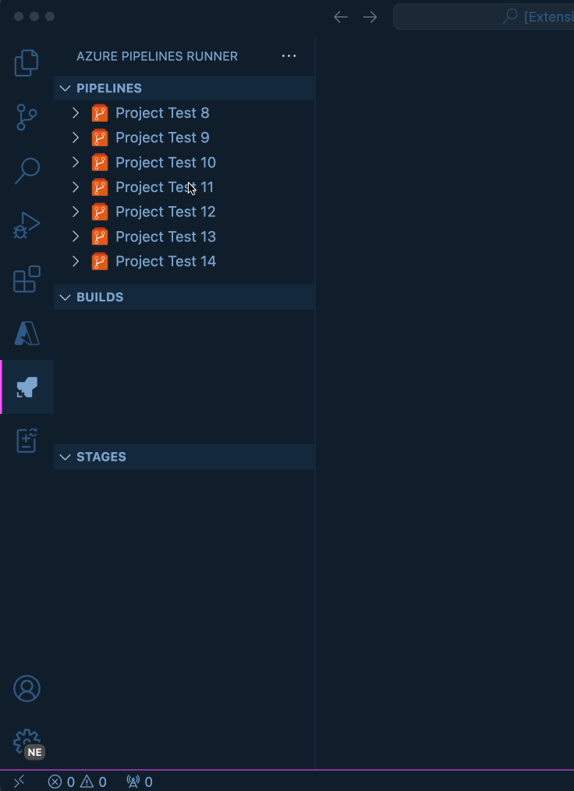

# Azure Pipelines Runner

Azure Pipelines Runner lets you explore and monitor your Azure DevOps pipelines directly from the editor.

It helps you keep track of builds, inspect logs, and understand pipeline status without constantly switching between VS Code and the Azure DevOps web portal.



---

## Get started

To start using Azure Pipelines Runner, you only need an Azure DevOps organization and a Personal Access Token (PAT).

Once configured, the extension will automatically load your projects, pipelines, and builds into the VS Code Explorer.

---

## Explore your pipelines

Use the Azure Pipelines Runner view to navigate through:

- Azure DevOps projects
- Pipelines within each project
- Builds associated with each pipeline

You can quickly inspect build status, stages, and execution logs, or open the selected pipeline or build in the Azure DevOps web UI when needed.

---

## Inspect build details

Selecting a build allows you to:

- View the current build status
- Inspect pipeline stages
- Open execution logs
- Jump directly to the build page in Azure DevOps

This makes it easier to investigate failures or understand what happened during a pipeline run without leaving your development environment.

---

## Requirements

To use this extension, you will need:

- An Azure DevOps Services (cloud) account
- A Personal Access Token (PAT) with the following permissions:
  - Build: Read & Execute
  - Code: Read
  - Release: Read, Write, Execute & Manage

> **Note:** Azure DevOps Server (on-premises) is not supported at this time.

---

## Extension settings

The following settings are required to configure the extension:

```json
{
  "azurePipelinesRunner.organization": "your-organization",
  "azurePipelinesRunner.pat": "your-personal-access-token"
}
```

---

## Contributing

There are a couple of ways you can contribute to this repo:

- **Ideas, feature requests and bugs**: We are open to all ideas and we want to get rid of bugs! Use the [Issues](https://github.com/pedroccaetano/azure-pipeline-runner/issues) section to report a new issue, provide your ideas or contribute to existing threads.
- **Documentation**: Found a typo or strangely worded sentences? Submit a PR!
- **Code**: Contribute bug fixes, features or design changes:
  - Clone the repository locally and open in VS Code
  - Install dependencies with `npm install`
  - Press `F5` to start debugging the extension

---

## Roadmap

Track progress and upcoming features on the [GitHub Project Board](https://github.com/users/pedroccaetano/projects/2).

---

## Changelog

For a detailed list of changes and release notes, please see the [CHANGELOG.md](CHANGELOG.md).
